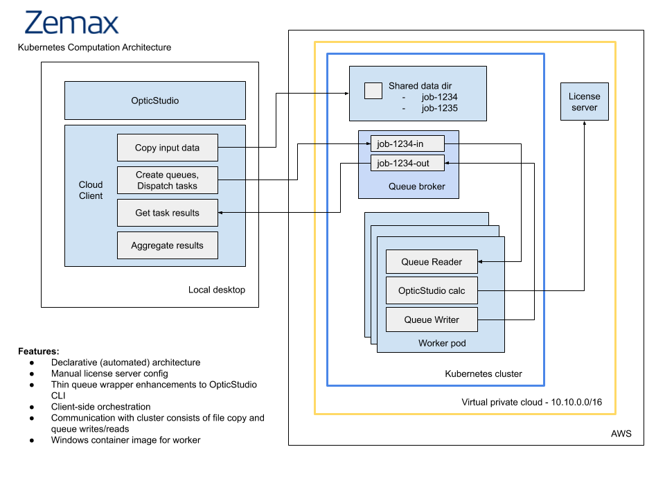

# optics-poc

## Introduction

This repos provides the Kubernetes proof of concept (POC) implementation for Zemax OpticStudio. The POC allows Zemax to demonstrate the feasibility of cloud-based compute augmentation for the OpticStudio desktop product.  This work enables future efforts to create a commercial offering for seamlessly offloading compute loads to the cloud. The POC utilizes Amazon Web Services (AWS) and Elastic Kubernetes System (EKS).  Work is done in a generic fashion, to the greatest extent possible, ensuring that the final commercial product can support any cloud or on-premise Kubernetes offering.

## Goals

The Kubernetes implementation design presented in this repo is proposed to satisfy the following goals for the POC:

* Kubernetes should be leveraged in order to provide a scalable cloud solution for expensive computations
* complexity of setup and integration should be minimized
* infrastructure and setup of the cloud components should be as highly automated as possible, minimizing manual effort
* the POC should utilize existing OpticStudio CLI executable with only small modifications as necessary

## Design

The proposed Kubernetes architecture for the POC is shown in figure 1 below.
 

The main components of the architecture are:

Cloud client – this C# executable is responsible for breaking a large computation job into a series of tasks.  Input assets (ZMX, ZAR files and ancillary config) are copied into a shared volume managed by the Kubernetes cluster in the cloud environment.  Input and output queues for the job are created in the queue broker and individual messages are dispatched to the input queue.  Output messages are read from the output queue and aggregated for further processing by OpticStudio.

Shared data directory – this is a shared volume managed by Kubernetes.  It uses a simple directory structure to segregate input assets (ZMX, ZAR files and ancillary config) by job number.

License Server – hosted on a stand-alone Elastic Compute Cloud (EC2) instance, the Zemax license server is configured manually, operates on the same network as the Kubernetes cluster, and provides license authorization for running compute pods within the cluster.

Queue Broker – the open source RabbitMQ broker is be used to handle inbound and outbound messages from the worker nodes. RabbitMQ is based on the standard AMQP protocol and  ensures reliable handling of messages and assists the worker pods in the event that retries are necessary following a crash or other failure to process an individual message.

Worker Pod – Kubernetes manages the lifecycle of the computationally-intensive worker pods.  The total running pod count can be scaled up or down by Kubernetes as needed to handle shifting workloads.  Each pod consists of a running instance of the modified OpticStudio container image.  The container consists of a thin C# wrapper around the OpticStudio command line executable.  The container consumes inputs from the input queue, invokes the Windows executable, and write the output to the output queue. 

AWS Infrastructure – an AWS Cloud Formation template is be used to stand up a working virtual private cloud (VPC), the license server EC2 instance, and ancillary security groups and subnets. The eksctl command line utility is then be used to create the Kubernetes cluster with a pre-determined set of nodes.  Finally, a set of Kubernetes configuration files is invoked to create the cluster workloads, services, and ingress components including the data directory, the queue broker, and the worker pods. 

## Operational Sequence

In order to utilize the cloud POC, these steps are executed in the following order:

1.	Cloud client (a C# command line executable) is deployed the desktop.
2.	AWS command line, eksctl, kubectl utilities are installed on desktop (these are all generic freely available commercial and open source tools).
3.	Zemax-specific cloud scripts and config files are copied to workstation.
4.	Cloud formation script is executed to build AWS environment.
5.	Zemax license server is installed manually (via RDP) in the new AWS environment.
6.	The eksctl utility is invoked to create the Kubernetes cluster.
7.	Kubernetes config files are deployed using kubectl utility, creating a running cluster.
8.	Cloud client is invoked on the desktop, providing input data (ZMX, ZAR files, and other inputs) and dispatches multiple tasks into the input queue.
9.	Cloud client pulls individual output messages from output queue until all responses have been returned.
10.	As long as the cluster is running, multiple jobs may be submitted in parallel.  Kubernetes can scale pod count up and down as necessary, however the fixed number of nodes (EC2 instances) will continue to run as long as the cluster is deployed.
11.	When all jobs are complete, the user can manually destroy the cluster from the desktop using the eksctl utility.
12.	When desired, entire cloud environment can be destroyed using the AWS command line from desktop.

